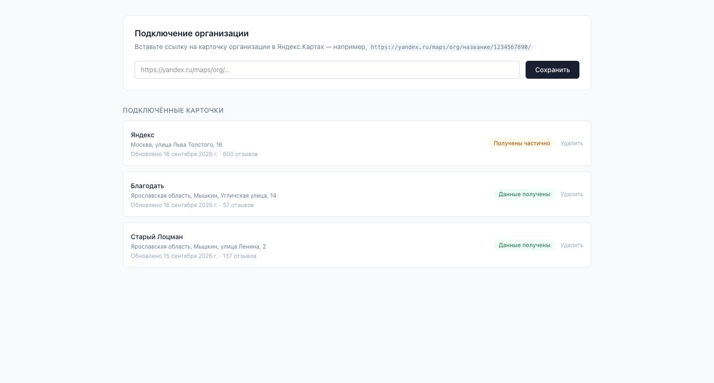
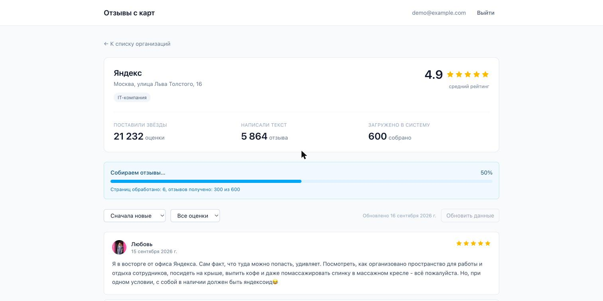

# Yandex.Maps Review Collector

A Laravel 13 API with a Vue 3 single-page frontend. Paste a link to any
organization card on Yandex.Maps and the application collects its reviews and
displays the rating, the counters and a paginated review list.

Yandex provides no public API for reviews, so every figure on screen is obtained
by parsing. That parser — and its behaviour when the source changes, blocks us
or runs out of data — is the substance of this project.

**Live demo: <https://yandex-maps-reviews.onrender.com>**
· sign in with `demo@example.com` / `password`

> The demo runs on a free plan and sleeps after ~15 minutes of inactivity, so
> the first request may take 30–60 seconds to wake it. See
> [Deployment](#deployment).

---

## Contents

- [What it looks like](#what-it-looks-like)
- [Feature overview](#feature-overview)
- [Quick start](#quick-start)
- [Environment variables](#environment-variables)
- [How the parsing works](#how-the-parsing-works)
  - [What the source actually returns](#what-the-source-actually-returns)
  - [Request signing](#request-signing)
  - [Measured limits of the source](#measured-limits-of-the-source)
  - [Choosing an approach](#choosing-an-approach)
  - [Why results are cached](#why-results-are-cached)
- [Deployment](#deployment)
- [Architecture](#architecture)
- [Database design](#database-design)
- [API reference](#api-reference)
- [Answers to the additional requirements](#answers-to-the-additional-requirements)
- [Testing](#testing)
- [Operational notes](#operational-notes)
- [What I would do with more time](#what-i-would-do-with-more-time)

---

## What it looks like

Captured from the live deployment.

**Sign-in.** No registration: one account, created by the seeder.


**Connected cards.** Each row carries its own parse status — note that the
Yandex card reads *Получены частично*, because its review count exceeds what the
source will serve.



**Collection in progress.** The parse runs in a queued job; the page polls the
run record and reports pages processed and reviews collected as they arrive.



**The card.** The three figures the brief asks for, kept apart and never summed:
**21 232 ratings**, **5 864 reviews**, **600 collected**. The notice below
explains the gap rather than leaving 600 to pass for the whole picture.


**Pagination.** 50 per page, 12 pages, switched without a reload — the reviews
come from our own storage rather than a fresh parse on every click.


---

## Feature overview

| Capability | Notes |
|---|---|
| Sign-in with email and password | Sanctum in SPA cookie mode; no sign-up, one seeded account |
| Save an organization link | Validated synchronously, stored, then parsed in the background |
| Average rating | Rounded to one decimal, as Yandex displays it |
| **Ratings count and reviews count, separately** | Two distinct figures that are never summed |
| Full review collection | Every review the source will serve (see the depth limit below) |
| Pagination, 50 per page | Client-side navigation, no page reloads |
| Sorting and rating filter | By date or rating, ascending or descending |
| Live progress | Pages processed, reviews collected, percentage |
| Explicit failure states | Distinct handling for blocks, schema changes and empty responses |
| Idempotent re-parsing | No duplicates; edits and disappearances recorded as history |

### Demo credentials

```
email:    demo@example.com
password: password
```

Both are set by `SEED_USER_EMAIL` and `SEED_USER_PASSWORD`.

---

## Quick start

### Option 1 — Docker

```bash
cp .env.example .env

# For docker-compose, adjust .env:
#   DB_HOST=mysql
#   DB_PORT=3306
#   DB_PASSWORD=secret

docker compose up -d --build

docker compose exec app composer install
docker compose exec app php artisan key:generate
docker compose exec app php artisan migrate --seed
docker compose exec app npm ci
docker compose exec app npm run build
```

The application is then available at <http://localhost:8000>.

Dependencies are installed after the containers start rather than baked into
the image, because the project directory is bind-mounted over `/var/www` — a
`composer install` performed during the build would be hidden by the mount. The
consequence is that the application is not usable between `up` and the end of
that command list: PHP has no autoloader yet and the web root returns a fatal
error. This is expected on a first launch and resolves once the steps above
finish.

The `queue` service handles this explicitly: instead of crash-looping while the
application is incomplete, it polls `migrate:status` and starts the worker only
once dependencies, the app key, the database connection and the schema are all
in place. `docker compose logs queue` shows `application ready, starting worker`
at that point. To scale workers: `docker compose up -d --scale queue=4`.

MySQL and Redis are published on host ports **13306** and **16379** rather than
the conventional ones. The application reaches them over the compose network;
the forwards exist only so a GUI client can connect from the host, and unusual
numbers keep a MySQL or Redis already running on the machine from making
`docker compose up` fail outright. Override with `DB_FORWARD_PORT` and
`REDIS_FORWARD_PORT`.

> **macOS note.** Docker Desktop only shares `/Users`, `/Volumes`, `/private`
> and `/tmp` by default. Cloning the project somewhere outside those paths — for
> example under `/Applications` — makes the bind mount fail with
> `mounts denied`. Either clone into your home directory or add the location
> under Docker Desktop → Settings → Resources → File Sharing.

Requires PHP **8.4** (the lock resolves Symfony 8.x, which will not install on
8.3) and Node **20.19+ or 22.12+** — Vite 8 rejects anything between, including
the whole of Node 21. Both Docker images already provide suitable versions.

MySQL and PostgreSQL are both supported and both were exercised with a full
parse — MySQL locally, PostgreSQL in the production image. Nothing in the
migrations or the repositories is engine-specific.

### Option 2 — MAMP

The project was developed against MAMP, and the values in `.env.example` match
its defaults (MySQL on port 8889, user `root`, password `root`).

```bash
# 1. Start Apache and MySQL from the MAMP control panel.

# 2. Create the database.
/Applications/MAMP/Library/bin/mysql80/bin/mysql -h 127.0.0.1 -P 8889 -u root -proot \
  -e "CREATE DATABASE yandex_reviews CHARACTER SET utf8mb4 COLLATE utf8mb4_unicode_ci;"

# 3. Install dependencies and build the schema.
cp .env.example .env
composer install
php artisan key:generate
php artisan migrate --seed
npm install && npm run build

# 4. Run the application and the worker, in two terminals.
php artisan serve
php artisan queue:work
```

To serve through MAMP's Apache instead, point its Document Root at
`/Applications/MAMP/htdocs/yandex-reviews/public` and add that address to
`SANCTUM_STATEFUL_DOMAINS`.

> **The queue worker is not optional.** Without it a card is saved but stays in
> the "queued" state forever — collection only ever happens in the background.

### Verifying the parser without the interface

```bash
php artisan scrape:check "https://yandex.ru/maps/org/yandex/1124715036/"
```

This parses a card and prints the result without writing anything to the
database. It is the fastest way to tell "the parser broke" apart from "the queue
broke" when data stops refreshing.

```
+--------------------+---------------------------------+
| Metric             | Value                           |
+--------------------+---------------------------------+
| Name               | Яндекс                          |
| Address            | Москва, улица Льва Толстого, 16 |
| Average rating     | 4.9                             |
| Ratings count      | 21229                           |
| Reviews count      | 5864                            |
| Reviews collected  | 600                             |
| Completeness       | 10%                             |
| Strategy           | internal_api                    |
| Pages fetched      | 12                              |
| Truncated          | yes (source_depth_limit)        |
| Elapsed            | 16.3s                           |
+--------------------+---------------------------------+
```

---

## Environment variables

The full annotated list lives in `.env.example`. The ones that matter:

| Variable | Purpose |
|---|---|
| `DB_*` | MySQL connection (MAMP uses port `8889`) |
| `SESSION_DRIVER` | Must be shared across processes: `database` or `redis` |
| `SESSION_DOMAIN` | `null` binds the cookie to the request host |
| `SANCTUM_STATEFUL_DOMAINS` | Frontend origins; a mismatch makes login return 419 |
| `QUEUE_CONNECTION` | `database` or `redis` |
| `SEED_USER_EMAIL`, `SEED_USER_PASSWORD` | Credentials for the seeded account |
| `SCRAPING_DELAY_MIN_MS`, `SCRAPING_DELAY_MAX_MS` | Range for the randomised inter-request pause |
| `SCRAPING_PROXIES` | Comma-separated proxy list |
| `SCRAPING_PROXY_COOLDOWN` | How long a blocked proxy stays out of rotation |
| `SCRAPING_YANDEX_MAX_REVIEWS` | Output depth limit, 600 by default |
| `SCRAPING_HEADLESS_ENABLED` | Enables the Playwright fallback strategy |

Two of these are worth calling out because they cause confusing failures:

- **`SANCTUM_STATEFUL_DOMAINS`** must contain the exact host *and port* the
  browser uses. If it does not, the login request returns `419 CSRF token
  mismatch` with no other clue as to why.
- **`SESSION_DOMAIN`** left as a literal hostname pins the cookie to that host.
  Setting it to `localhost` and then browsing to `127.0.0.1` silently discards
  the session cookie and every request looks anonymous.

---

## How the parsing works

### What the source actually returns

Yandex.Maps has no public reviews API. However, the card page is rendered
server-side and embeds the full application state as JSON inside a
`<script class="state-view">` tag. Two things are extracted from it:

| Data | Path within the JSON |
|---|---|
| Name, address, categories | `stack[0].results.items[].title`, `.fullAddress`, `.categories` |
| **Average rating** | `ratingData.ratingValue` |
| **Ratings count** | `ratingData.ratingCount` |
| **Reviews count** | `ratingData.reviewCount` |
| CSRF token | `config.csrfToken` |
| Session identifier | `config.counters.analytics.sessionId` |

Note that all three required figures come from one object and are already
distinct there — `ratingCount` (people who left stars) is roughly four times
`reviewCount` (people who wrote text) on a typical large card.

The reviews themselves are **not** in that JSON. A script fetches them after the
page renders, which is why parsing the HTML alone is not sufficient and a second
step against `/maps/api/business/fetchReviews` is required.

### Request signing

The internal endpoint rejects any request lacking an `s` parameter. It is not a
cryptographic signature and not a secret: it is a checksum over the parameter
set that Yandex's own frontend computes in the browser. The algorithm was
recovered from their client bundle and has two steps:

1. Parameters are serialised into a query string with keys sorted
   **case-insensitively** (the `qs` library, RFC 3986 percent-encoding, `null`
   rendered as an empty value).
2. A DJB2-with-XOR variant is hashed over that string — seed `5381`,
   `hash = (hash * 33) ^ codeUnit` — and coerced to an unsigned 32-bit integer.

The original, as found minified in the maps bundle:

```js
var u = function(e) {
    var t = s.stringify(e, {sort: function(e, t) {
        var r = e.toLowerCase(), n = t.toLowerCase();
        return r < n ? -1 : r > n ? 1 : 0;
    }});
    return t ? String(function(e) {
        for (var t = e.length, r = 5381, n = 0; n < t; n++)
            r = 33 * r ^ e.charCodeAt(n);
        return r >>> 0;
    }(t)) : "";
};
```

Two subtleties are worth recording, because both would produce a signature that
is wrong only some of the time:

- `charCodeAt` yields **UTF-16 code units**, not code points. The PHP
  implementation converts to UTF-16LE and unpacks, so a non-Latin parameter
  value hashes identically to the browser.
- In JavaScript `33 * r` is a double coerced to int32 by the XOR. The product
  never exceeds 2^53, so no precision is lost, and masking with `0xFFFFFFFF`
  reproduces the coercion exactly.

The implementation is `app/Services/Scraping/Yandex/RequestSigner.php`, pinned
by reference vectors in `tests/Unit/Scraping/RequestSignerTest.php`.

The required parameter set is `ajax`, `csrfToken`, `sessionId`, `businessId`,
`ranking`, `page`, `pageSize`, `locale`, plus the computed `s`. Omitting
`locale` returns a validation error; omitting `s` returns `400`.

### Measured limits of the source

These were established empirically against live cards, not assumed:

| Limit | Observation |
|---|---|
| `pageSize` | Caps at **50**. Larger values return a nested error. |
| Output depth | The last working page is the **12th** (`offset` 550). Page 13 (`offset` 600) fails consistently and reproducibly. |
| Error transport | **HTTP 200** carrying `{"error":{"code":500,...}}` in the body. |
| Captcha transport | Also HTTP 200, with `type: "captcha"`, or a redirect to `/showcaptcha`. |

Two conclusions follow, and both shaped the design:

**The "roughly 600 reviews" figure in the brief is Yandex's own ceiling, not a
limitation of this parser.** Nothing reaches deeper — not a headless browser,
not any other technique — because the Maps interface itself calls the same
endpoint under the same constraints. For a card declaring 5,864 reviews the
application therefore reports "600 collected out of 5,864" and flags the data as
partial, rather than presenting 600 as the complete picture.

**A `$response->successful()` check is useless here**, because failures arrive
with status 200. The parser validates the *shape of the response body* instead
(`ReviewsResponseValidator`), which is what makes the difference between
detecting breakage and silently storing nothing.

### Choosing an approach

Two strategies are implemented behind the `ScrapeStrategy` interface.

**Primary — parsing the internal JSON API** (`InternalApiStrategy`)

| | |
|---|---|
| Speed | 600 reviews in **~16 seconds** across 13 HTTP requests, measured on a live card |
| Memory | That of an ordinary HTTP client |
| Robustness to markup | High — structured JSON, no DOM or CSS classes involved |
| Robustness to contract | **Low** — depends on an undocumented signing scheme and parameter set |
| Blocking exposure | Higher at volume; plain HTTP is easier to fingerprint than a browser |

**Fallback — a headless browser** (`HeadlessBrowserStrategy`, Playwright)

| | |
|---|---|
| Speed | **45s** for the same 600 reviews, against 16s for the fast path — measured, not estimated |
| Memory | Hundreds of megabytes per browser process |
| Robustness to markup | **High** — it reads the server-rendered state and intercepts `fetchReviews` responses; it never parses review markup, so CSS renames are irrelevant |
| Robustness to contract | **High** — the browser builds and signs the requests, so a change to the signing algorithm costs nothing |
| Deployment | Requires Node plus `npm install -D playwright && npx playwright install chromium` |

It is **not installed by default**, and deliberately not part of the production
image: Chromium does not fit the free plan's 512 MB, and bundling it would add
roughly 700 MB to a 207 MB image. `isAvailable()` probes for Node and the
library and drops the strategy from the chain when either is missing, so the
application runs unchanged without it.

To exercise it locally:

```bash
npm install -D playwright && npx playwright install chromium
# then set SCRAPING_HEADLESS_ENABLED=true
```

**Both strategies return identical records.** Verified on a live card: the same
23 reviews, the same 23 `reviewId` values, and the same 23 content hashes. That
matters more than it sounds — it means a mid-life switch between strategies
produces no duplicates and no spurious revisions, because the idempotency key
and the change-detection hash both survive the swap.

**The decision: run the fast path, fall back only on a detected contract
change.** The switching rule is deliberately narrow — the fallback fires on
`SourceSchemaChangedException` and nothing else. If the source is merely
unavailable or we have been blocked, retrying with a different strategy from the
same address changes nothing; that is the queue's job, with backoff. Spinning up
a browser for a network blip would burn minutes of CPU to achieve exactly what a
30-second retry achieves.

The fallback is disabled by default (`SCRAPING_HEADLESS_ENABLED=false`), and if
Node or Playwright are absent `isAvailable()` returns false and the strategy is
dropped from the chain rather than failing at runtime.

### Why results are cached

Parsing happens once, in the background; the results go into the database, and
review pages are served by an ordinary Laravel paginator.

The alternative — fetching from Yandex on every page change — would mean **13
calls to an external source per click**. That is seconds of latency in the
interface and a rate-limit block within the first minutes of use. It would also
make the remaining requirements impossible: there would be nothing to run in the
background and no baseline against which to compute a change history.

---

## Deployment

The live instance runs on Render's free plan. Everything it needs is committed:
`render.yaml` describes the service and the database, and
`docker/production/Dockerfile` builds the image.

### How the production image differs from the development one

They are deliberately different artefacts, and the differences are forced by the
platform rather than chosen for their own sake.

| | Development (`docker-compose.yml`) | Production (`docker/production/`) |
|---|---|---|
| Source code | Bind-mounted, edits appear immediately | Copied into the image, immutable |
| Dependencies | Installed after `up`, into the mount | Installed at build time, in separate stages |
| Frontend bundle | Built by hand with `npm run build` | Built in a Node stage and copied in |
| Web server | Its own nginx container | nginx inside the app container |
| Queue worker | Its own `queue` service | Same container, run by supervisor |
| Database | MySQL container | Render's managed PostgreSQL |
| OPcache timestamps | Validated, so edits take effect | Disabled — code cannot change in an image |

Two of those deserve an explanation rather than a table row.

**The queue worker shares the container.** Splitting the web tier from the
worker is the better arrangement, which is why the development compose file does
exactly that. Render's free plan has no background workers, so here supervisor
runs php-fpm, nginx and `queue:work` side by side. The trade-off is real: the
processes compete for the same 512 MB, and a restart takes the worker down with
the web tier. It is stated here rather than hidden, and on any plan with a
separate worker process the two should be split again.

**PostgreSQL instead of MySQL.** Render's free tier offers no MySQL, and its
filesystem is ephemeral — SQLite would lose every row whenever the service
restarts or wakes from idle. Nothing in the application is MySQL-specific; the
migrations, the repositories and a full parse were all verified against
PostgreSQL before this was committed.

### Deploying from scratch

1. **Create the blueprint.** In the Render dashboard choose **New → Blueprint**,
   point it at this repository and apply. Render reads `render.yaml`, creates the
   PostgreSQL instance and the web service, and generates `APP_KEY` once so it
   stays stable across deploys.

2. **Wait for the first build.** It takes several minutes: three Docker stages
   run, one of which installs Node dependencies and builds the frontend bundle.

3. **Provide the two prompted values.** `APP_KEY` and `DB_URL` are marked
   `sync: false`, so Render asks for them rather than reading them from the
   repository. Generate the key with `php artisan key:generate --show` and paste
   the connection string from the database provider.

4. **Check the Sanctum domain.** `render.yaml` names the expected hostname; if
   Render assigns a different one, set `SANCTUM_STATEFUL_DOMAINS` to match.
   A mismatch makes login fail with `419 CSRF token mismatch` and no other
   diagnostic — the cookie is issued but never accepted.

5. **Verify the source is reachable.** Requests now leave a datacentre IP, which
   Yandex challenges more readily than a residential one. Open a shell on the
   service and run the parser directly:

   ```bash
   php artisan scrape:check "https://yandex.ru/maps/org/yandex/1124715036/"
   ```

   A table of figures means the deployment works end to end. `blocked` means the
   region is being challenged: either move the service to another region or
   supply proxies through `SCRAPING_PROXIES`, which the scraper already supports.

No migration step is needed. The entrypoint runs `migrate --force` and reseeds
the demo account on every boot; both are idempotent, so a restart cannot
duplicate anything, and the demo login survives a database reset.

### What the free plan means for whoever opens the link

- **The service sleeps after about 15 minutes of inactivity.** The first request
  after that takes roughly 30–60 seconds while the container starts, migrations
  run and caches rebuild. Subsequent requests are immediate.
- **A parse interrupted by sleep is not lost.** The job stays in the queue and is
  retried when the worker comes back, because the queue lives in the database
  rather than in memory.
- **Render's free PostgreSQL expires.** Free instances are removed after a
  limited period; the deployment has to be recreated afterwards. Fine for a
  demonstration, not for anything that must stay up.

### Four failures worth recording

The deployment did not work first time, and each failure was silent in a
different way. They are listed because "it deployed" is not the same as "it
works", and each one cost real time to identify.

**One free database per account.** The blueprint declared a Render PostgreSQL
instance, which fails outright on an account that already has one — and because
a blueprint applies atomically, it cancelled the web service too. The database
is now external.

**The wrong variable name.** The blueprint set `DATABASE_URL`, but Laravel reads
`env('DB_URL')`. The value was ignored and the app fell back to `127.0.0.1`,
which reads like a network fault rather than a typo.

**No HOME for unprivileged processes.** php-fpm workers and the queue worker run
as `www-data` but inherited `HOME=/root`. libpq looks there for an optional
client certificate and aborts the connection on "Permission denied" instead of
treating the file as absent. Migrations were fine — the entrypoint runs as root —
so the deploy reported success while every page returned 500.

**An untrusted proxy.** Render terminates TLS and forwards over HTTP, marking
the scheme in `X-Forwarded-Proto`. Laravel ignores that header unless the proxy
is trusted, so it generated `http://` asset URLs on an `https://` page. The
browser blocked them as mixed content: a blank page behind a 200 response, with
every API endpoint answering correctly. This one is invisible to any check that
does not actually render the page.

A fifth, milder one: Render's `generateValue` produces a key without the
`base64:` prefix Laravel requires, which surfaces as "Unsupported cipher or
incorrect key length" — a message that points at the cipher rather than the key.

### And two in the fallback strategy

Installing Playwright and actually running the fallback turned up two more,
both of which would have gone unnoticed while it sat behind a disabled flag.

**A card that fits in one render issues no XHR at all.** The strategy was
written to scroll and intercept `fetchReviews`, which is correct for a large
card — but a card with 23 reviews server-renders all of them and never makes the
request, so interception alone returned zero. It now reads the reviews out of
the rendered state first and treats intercepted responses as the continuation.

**Programmatic scrolling does not trigger the lazy-load.** Setting `scrollTop`
or calling `scrollBy` moves the container — the offset genuinely reaches the
bottom — but produces untrusted events, and the list stays at its first batch
indefinitely. Driving the wheel through Playwright's input layer loads the rest.
A related bug rode along: with no intercepted response there was no declared
total, so a run that collected 50 of 5,864 reported itself complete.

### Verified before committing

The production image was built locally, run against PostgreSQL and exercised end
to end before being pushed — and then the same checks were run again against the
live deployment:

- all three processes confirmed running under supervisor;
- `/`, `/login` and the `/up` health check returning 200, a guest `/api/me`
  returning 401;
- a real card parsed by the worker **inside** the container — 137 reviews, job
  log showing `RUNNING → DONE`;
- pagination across three pages, rating filter, sort order, and rejection of
  invalid parameters;
- the image confirmed to contain no `.env` and no development compose file.

On the live instance, the same flow was driven through HTTPS: sign in, reject an
invalid link, connect a card, wait for the worker to finish, then read back 137
reviews across three pages with filtering and sorting. The card renders in the
browser with the rating and both counters shown separately. No captcha was
returned from the Frankfurt datacentre IP, which was the main open risk.

---

## Architecture

```
app/
├── Contracts/
│   ├── ReviewsSource, ScrapeStrategy, SourceUrlParser
│   └── Repositories/               OrganizationRepository, ReviewRepository,
│                                   ParseRunRepository
├── Repositories/Eloquent/          Implementations of the three contracts
├── Data/                           SourceReference, OrganizationData, ReviewData,
│                                   ScrapeResult, ScrapeProgress, ReviewQuery, SyncStats
├── Enums/                          ParseStatus, FailureReason, ReviewSort
├── Exceptions/Scraping/            Exception hierarchy with machine-readable causes
├── Jobs/
│   └── ParseOrganizationJob        Background collection with progress and retries
├── Services/
│   ├── Scraping/
│   │   ├── SourceRegistry          Resolves a link to its platform
│   │   ├── Support/
│   │   │   ├── UserAgentRotator    Consistent UA + client-hint profiles
│   │   │   ├── ProxyPool           Rotation with per-address health tracking
│   │   │   └── RequestThrottle     Randomised pauses and exponential backoff
│   │   └── Yandex/
│   │       ├── YandexMapsSource        Strategy chain and fallback policy
│   │       ├── YandexUrlParser         Link parsing, 9 accepted URL shapes
│   │       ├── YandexBootstrapper      HTML to page state and session tokens
│   │       ├── RequestSigner           Request signing
│   │       ├── ReviewsResponseValidator Breakage detection
│   │       └── Strategies/             InternalApiStrategy, HeadlessBrowserStrategy
│   └── Organizations/
│       └── OrganizationSyncService Idempotent persistence and change history
├── Http/                           Controllers, FormRequests, API Resources
├── Rules/SupportedSourceUrl        Synchronous link validation
└── Console/Commands/               scrape:check diagnostic command
```

Controllers are thin by design. Link parsing lives in the source, the parse in a
job, persistence behind the repositories. No route or controller makes a call to
an external source, and none builds a query.

Adding a new platform (2GIS, for instance) means implementing `ReviewsSource`
and adding one line to `ScrapingServiceProvider`. Controllers, models, jobs and
the frontend stay untouched.

### On the repository layer

Two kinds of abstraction are present here, and they earn their place
differently.

`ReviewsSource` and `ScrapeStrategy` have **more than one real implementation**
and are genuinely swapped at runtime — Yandex today and 2GIS next, the JSON API
by default and a headless browser when the contract breaks. Those are
load-bearing.

The repositories are a **layering decision**, not a swap point: there will only
ever be one Eloquent implementation, and pretending otherwise would be
dishonest. What justifies them is that they hold domain knowledge which would
otherwise be scattered across callers:

- what "visible" means — a review that disappeared from the source still exists
  as a row but must stay out of every listing and count;
- that ordering always needs a unique tie-breaker, or rows sharing a timestamp
  reorder between queries and the same review surfaces on two pages;
- that there is at most **one pending run per card**, because the parse job is
  unique per organization and a second row would be orphaned.

Each of those is a rule about the data, and each is now stated in exactly one
place. The methods are named for those intentions — `paginateVisible`,
`findExistingByExternalIds`, `markDisappeared` — rather than as CRUD verbs. A
repository whose methods are `find`, `all` and `save` is pure indirection over
the ORM and is worth avoiding.

Filtering and pagination arrive as a single `ReviewQuery` object, so the
repository cannot accumulate methods such as `findByRatingAndSortAndPage()` as
new filters appear, and the sort order is a `ReviewSort` enum, so an unsupported
value cannot reach the query builder at all.

One boundary is deliberately *not* crossed: `OrganizationSyncService` keeps the
transaction and the decision-making. The repositories own the queries, but a
transaction split across two classes would be a genuine defect rather than a
matter of taste.

### Frontend

Vue 3 with the Composition API throughout (`<script setup>`), Pinia for state,
Vue Router for navigation, Tailwind for styling, Vite for the build.

```
resources/js/
├── api/            Axios instance with credentials, plus endpoint definitions
├── stores/         auth, organizations
├── composables/    usePolling, useFormatters
├── router/         Guards for authenticated and guest-only routes
├── pages/          LoginPage, SettingsPage, OrganizationPage
└── components/     RatingSummary, ReviewList, ReviewCard, PaginationNav,
                    ParseProgress, AlertMessage, StarRating, LoadingSpinner
```

Loading and error states are visible throughout: a live progress bar during
background collection, distinct messages per failure cause, and a separate,
deliberately calm notice for the "we hit the source's depth limit" case so it is
not mistaken for a malfunction.

---

## Database design

| Table | Purpose |
|---|---|
| `organizations` | The card: URL, rating, both counters, parse status |
| `reviews` | Reviews, unique on `(organization_id, external_id)` |
| `parse_runs` | Run log: progress, strategy, error code and diagnostic context |
| `organization_snapshots` | Aggregates frozen per run — the rating trend over time |
| `review_revisions` | Before/after for edited reviews |

Design decisions worth stating explicitly:

- **The idempotency key is `(organization_id, external_id)`**, never the text or
  the author. A review's identifier on the source is stable; its content is not.
- **`content_hash`** distinguishes "already seen" from "the author edited it"
  without diffing text on every run.
- **`disappeared_at` instead of deletion.** A review pulled from the platform is
  a meaningful event for a reputation service, not noise to be discarded. The
  flag is only applied after a *complete* run — see requirement 5 below.
- **`reviews_stored` alongside `reviews_count`** so that the divergence between
  what exists and what we hold is explicit in the data model rather than
  inferred.
- **A composite index on `(organization_id, published_at)`** covering the
  interface's main query, rather than two separate single-column indexes.

---

## API reference

All endpoints are session-authenticated via Sanctum. Obtain the CSRF cookie from
`GET /sanctum/csrf-cookie` before the first non-GET request.

| Method | Endpoint | Purpose |
|---|---|---|
| `POST` | `/api/login` | Sign in; rate-limited to 5 attempts per email and IP |
| `POST` | `/api/logout` | Sign out and invalidate the session |
| `GET` | `/api/me` | The current user; 401 when not signed in |
| `GET` | `/api/organizations` | Connected cards with their latest parse run |
| `POST` | `/api/organizations` | Connect a card and queue collection |
| `GET` | `/api/organizations/{id}` | One card, including live progress |
| `POST` | `/api/organizations/{id}/refresh` | Re-run collection; 409 if already running |
| `DELETE` | `/api/organizations/{id}` | Disconnect a card |
| `GET` | `/api/organizations/{id}/reviews` | Paginated reviews |

The reviews endpoint accepts `page`, `per_page` (max 100), `rating` (1–5) and
`sort` (`date_desc`, `date_asc`, `rating_desc`, `rating_asc`).

Scraping failures are rendered as `422` with a machine-readable cause rather
than a bare `500`:

```json
{
  "message": "Изменилась структура ответа источника",
  "error": {
    "code": "schema_changed",
    "detail": "В отзыве пропали ожидаемые поля: reviewId"
  }
}
```

---

## Answers to the additional requirements

### 1. Resilience to markup changes

A bare `try/catch` is not enough. It catches crashes but not *silent
degradation*, where the request formally succeeds and the data is simply absent.

**What is validated on every response** (`ReviewsResponseValidator`):

- **Field contract** — `reviewId`, `rating`, `updatedTime` and the `author`
  block must be present, as must the pagination fields `page`, `limit`, `count`
  and `totalPages`.
- **Errors nested in a successful response** — the source serves failures with
  HTTP 200, so the body is inspected rather than the status code.
- **Captcha** — the `type: "captcha"` field, and redirects to `/showcaptcha`.
- **The page-state marker** — if `<script class="state-view">` disappears, the
  delivery mechanism has changed.
- **Reconciliation with the card** — if the card declares N reviews and
  substantially fewer were collected while the depth limit was not reached, the
  parser is broken, not the business unpopular.

**How breakage is reported:**

- A `SourceSchemaChangedException` with the cause `schema_changed`.
- The run is marked `failed` and **a slice of the actual response body is stored
  in `parse_runs.error_context`** — without a sample, debugging a parser that
  broke in production is guesswork.
- It is logged at **`error`** level, unlike blocks and network failures which log
  at `warning`. This is the one cause that requires a code change, so it is the
  one that should page someone.
- It is **not retried**. Retrying cannot fix a contract change; it only consumes
  queue capacity.
- The interface shows an explicit message: the source changed format and
  collection was stopped deliberately.

The governing principle: **"empty" and "broken" are different states and must
never look alike.** Zero reviews when `reviews_count > 0` is always an error.

### 2. Justification of the parsing approach

Covered in detail under [Choosing an approach](#choosing-an-approach), with the
measured trade-off tables.

In brief: the primary path parses the internal JSON API — fast, cheap,
structured, but fragile to contract changes. The fallback is a headless browser —
resilient but slow and heavy. Switching happens only on a *detected contract
change*, never on an arbitrary error, because a ban or a network blip is cured
by backoff rather than by a different strategy from the same IP.

### 3. Scale and background processing

Implemented. A chain of 50 branches at 600 reviews each is roughly 650 calls to
the source — impossible synchronously inside an HTTP request.

- `ParseOrganizationJob`, one job per organization, on a Redis or database queue.
- `$tries = 3` with `backoff() = [30, 120, 300]` — a growing pause, because an
  immediate retry after throttling makes the situation worse.
- `ShouldBeUnique` plus `WithoutOverlapping` keyed on `organization_id`, so two
  workers never parse the same card concurrently. The uniqueness lock outlives
  the job timeout to cover a hung worker.
- **Progress** is written to `parse_runs` as collection proceeds (pages, reviews,
  percentage) and polled by the frontend every two seconds while the job runs.
  Polling stops as soon as the run finishes.
- `failed()` records the cause in `parse_runs` rather than losing it in
  `failed_jobs`.
- A branch network is a `Bus::batch` of these jobs: aggregate progress per batch,
  with `allowFailures` so one failing branch does not abort the rest.
- **Partial results are persisted.** If collection breaks off midway, the reviews
  already gathered are saved and the status is `partial` rather than `failed`.
  Only a failure to read even the first page is a hard failure.

Worker scaling: `docker compose up -d --scale queue=4`.

### 4. Avoiding bans at volume

Implemented in `app/Services/Scraping/Support`:

- **Throttling with a randomised pause** (`RequestThrottle`) — the interval is
  drawn from a range, because a perfectly even interval is itself a signature of
  automation.
- **Exponential backoff** on 429 and on captcha, with a cap so a job cannot sleep
  for hours inside one attempt.
- **User-Agent rotation** (`UserAgentRotator`) paired with a *consistent* header
  set — `Sec-CH-UA`, platform, language. Mismatched headers, such as a Chrome
  User-Agent alongside Firefox client hints, give a bot away far more reliably
  than a User-Agent that never changes. The profile is pinned for the duration of
  one organization's run, since swapping identity between pages of a single
  session is more suspicious than a stable one.
- **A proxy pool with health tracking** (`ProxyPool`) — a blocked address is
  taken out of rotation for a cooldown. State lives in the shared cache rather
  than process memory so that every worker sees every block. Without this,
  rotation actively makes matters worse: you keep hammering from a blocked IP and
  extend the ban.
- **An explicit "we are blocked" state** — `SourceBlockedException` moves the job
  into backoff instead of driving further attempts.
- **Session reuse** within one organization: one bootstrap serves twelve pages
  instead of twelve HTML loads.

Described but not implemented: spreading scheduled refreshes over time rather
than firing all 50 branches at 03:00, and a circuit breaker that pauses a
source's queue entirely after a run of consecutive blocks.

### 5. Idempotency and change history

Fully implemented in `OrganizationSyncService`.

- **No duplicates.** The key is `(organization_id, external_id)`; a repeat run
  updates in place. Verified against a live card: after a second pass, 137
  reviews remained 137, with `created = 0` and `updated = 0`.
- **Edits.** A divergence in `content_hash` writes a row to `review_revisions`
  carrying the old and new text and rating. For a reputation service this
  matters: a review can turn negative after someone has already replied to it.
- **Disappearances.** Reviews absent from a run are stamped with
  `disappeared_at` rather than deleted, and are excluded from the listing while
  remaining in the database as history. **This only happens after a complete
  run** — if collection broke off or hit the depth limit, the "missing" reviews
  were never requested, and flagging them would corrupt the data. This
  distinction is covered by a dedicated test.
- **Restoration.** A review that returns to the listing has its flag cleared.
- **Aggregate trends.** `organization_snapshots` records the rating and counters
  per run; `diffFrom()` returns a ready-made before/after map.

---

## Testing

```bash
php artisan test   # backend — 113 tests, 260 assertions
npm test           # frontend — 45 tests
```

**158 tests in total.** No test touches the network.

| Suite | Coverage |
|---|---|
| `RequestSignerTest` | Reference vectors for the signing algorithm, key sorting, RFC 3986 encoding, UTF-16 handling |
| `YandexUrlParserTest` | 9 accepted URL shapes, rejection of foreign domains and look-alike spoofs |
| `ReviewsResponseValidatorTest` | Detection of schema changes, captchas, and errors nested in 200 responses |
| `AuthenticationTest` | Sign-in, brute-force throttling, route protection, session teardown |
| `OrganizationTest` | Validation, queueing rather than inline parsing, per-user isolation |
| `ReviewPaginationTest` | 50 per page, no duplicates across pages under identical timestamps |
| `OrganizationSyncTest` | Idempotency, revisions, snapshots, truncated-run safety |
| `ReviewRepositoryTest` | Visibility rules, stable ordering, per-organization isolation |
| `ParseRunRepositoryTest` | Pending-run reuse, so a dropped duplicate dispatch cannot orphan a run |
| `YandexMapsSourceTest` | The fallback policy: the browser is engaged on a contract change and on nothing else |
| `SourceRegistryTest` | Link-to-platform resolution, and that the container wiring produces a usable source |
| `ProxyPoolTest` | A blocked address leaves rotation and comes back only when cleared |
| `ReviewQueryTest` | Clamping of page size and page number, and that every sort ends with a unique column |

Several encode findings that would otherwise be easy to regress: the signing
vectors; the assertion that pages never overlap when every review shares a
timestamp; and the fallback policy, which is a judgement call rather than a
mechanism — the browser is engaged when the fast path's contract has changed and
never because the source is merely blocked or unreachable, since a different
strategy from the same address changes nothing there.

Validation lives in form requests rather than in controllers — `LoginRequest`,
`StoreOrganizationRequest` and `IndexReviewsRequest` — with the link check
extracted further into a `SupportedSourceUrl` rule that consults the source
registry. The listing request hands the repository a typed `ReviewQuery` rather
than a raw array.

On the frontend, Vitest covers the two modules where the logic is worth pinning
and no browser is needed:

| Suite | Coverage |
|---|---|
| `safeRedirect.test.js` | The post-login redirect target: internal paths pass, `//host`, `/\host`, absolute URLs, script schemes and non-strings fall back to the default route |
| `useFormatters.test.js` | Russian plural agreement, including the teens — 11 and 111 are what a naive last-digit rule gets wrong — and the counters exactly as the interface renders them |

`safeRedirect` deserves the attention it gets: the value arrives from the
address bar, on a page that legitimately asks for a password. Vue Router
rejects hostile values today, so this was never exploitable, but that is a
behaviour nobody promised and the guarantee now lives in our own code.

What is deliberately not covered: the strategies' HTTP layer, which would need
recorded fixtures; the headless browser, which would need a browser in CI; and
the Vue components themselves, which are exercised end to end rather than in
isolation. All three are checked by hand against the live deployment.

---

## Operational notes

- **Datacentre IPs are challenged far more readily than residential ones.** This
  constrains the choice of host for a public demo rather than the other way
  round; budget for proxies if the deployment target is a cheap VPS.
- **Port conflicts.** `php artisan serve` binds to 8000 by default, which
  frequently collides with Docker or other local services. If the app appears to
  respond with unrelated JSON, something else owns the port.
- **The `scrape:check` command is the first diagnostic to run** when data stops
  refreshing; it isolates the parser from the queue in a single step.

---

## What I would do with more time

1. **Incremental parsing.** Every run currently fetches all available reviews.
   With `by_time` ordering the parser could stop at the first already-known
   `external_id`, cutting load on the source by an order of magnitude for
   scheduled refreshes.
2. **A circuit breaker per source.** After a run of consecutive blocks, pause the
   whole platform's queue rather than relying on per-job backoff.
3. **A change-history screen.** The data is already collected
   (`organization_snapshots`, `review_revisions`) but has no interface — a rating
   chart and a before/after feed.
4. **Broadcasting instead of polling.** Two-second polling is fine for a single
   card; a branch network warrants push over Reverb.
5. **Parser health monitoring.** A success-rate metric and an alert on
   `schema_changed` — that error means Yandex changed something, and we should
   learn about it before the user does.
6. **HTTP-level strategy tests.** The strategies' network layer is not covered by
   `Http::fake()`; real source responses should be captured as fixtures and
   replayed. The headless strategy has been exercised by hand against live cards
   but has no automated coverage, since that would mean running a browser in CI.
7. **2GIS.** The interfaces are already in place; it needs a second
   `ReviewsSource` implementation.
8. **Split the worker back out in production.** Sharing a container with the web
   tier is a concession to the free plan, not a design preference; on any plan
   with background workers they should be separate services again, as they
   already are in development.
